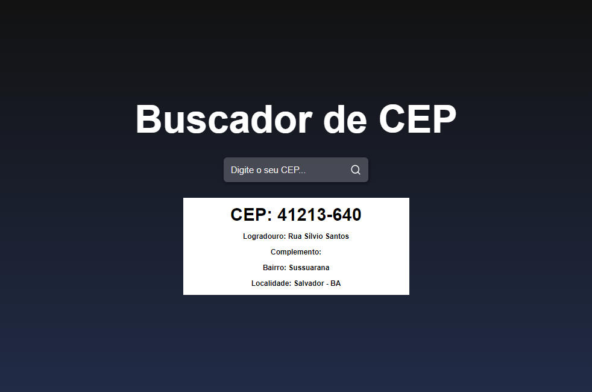

# Project Zip Code Finder
### Made with React.JS

# API that was used:
### https://viacep.com.br/ws/XXXXXX/json/
##### put your zip code in the place where the XXX is

### Thanks <a href="https://www.youtube.com/c/Sujeitoprogramador">SUJEITO PROGRAMADOR</a>  for teaching how to use it!

